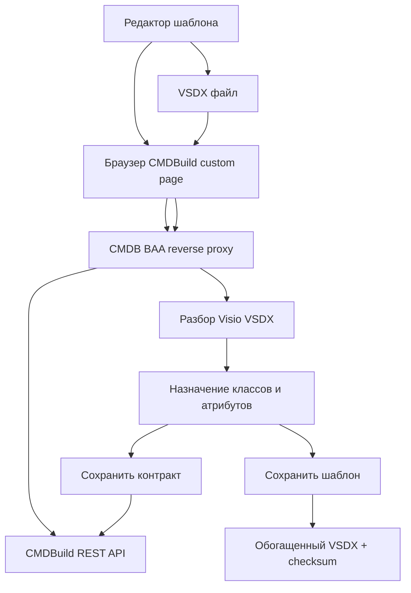
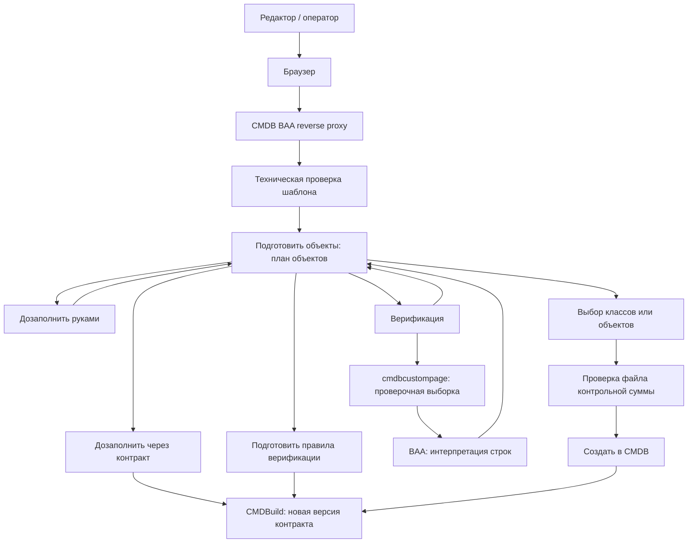

# Бизнес-процессы

## BP-01 Подготовка шаблона

Позитивный сценарий:

1. Редактор загружает VSDX.
2. BAA проверяет контрольную сумму, если настройка включена.
3. Редактор выбирает контракт и объект контракта на схеме.
4. Редактор назначает CMDB-классы и атрибуты.
5. Редактор сохраняет контракт.
6. Редактор сохраняет обогащенный шаблон.

Негативные сценарии:

- файл VSDX не загружен;
- контрольная сумма отсутствует или не совпадает;
- схема BAA в CMDBuild не создана;
- контракт не выбран;
- объект контракта не найден в VSDX;
- CMDBuild REST API недоступен.

Логируемые события:

- начало разбора VSDX;
- результат проверки checksum;
- создание/переиспользование версии контракта;
- сохранение обогащенного VSDX;
- ошибка CMDBuild REST API.

## BP-02 Подготовка и создание объектов

Позитивный сценарий:

1. Оператор загружает заполненный VSDX.
2. В `Подготовить объекты` BAA строит план объектов.
3. Оператор устраняет недостающие обязательные значения.
4. Оператор или администратор готовит правила верификации: выбирает
   input/output contracts, endpoint URL, params и `ResultInterpretationJson`.
5. Оператор выполняет `Верификация`: BAA отправляет план во внешний endpoint,
   получает `items/tables` и интерпретирует наличие или отсутствие строк по
   настройке endpoint.
6. В отдельном пункте `Создать объекты` оператор выбирает классы или конкретные
   объекты плана.
7. BAA проверяет наличие и корректность файла контрольной суммы.
8. BAA создает выбранные объекты в CMDBuild по последнему подготовленному плану.

Негативные сценарии:

- в шаблоне нет версии контракта;
- checksum версии контракта не совпадает;
- есть обязательные незаполненные атрибуты;
- есть висящие связи, которые не позволяют собрать обязательные значения;
- отсутствует или не совпадает файл контрольной суммы;
- внешняя верификация дала `failed` или `technical_error`;
- CMDBuild отклоняет payload валидатором.

## Вспомогательные процессы

- bootstrap схемы BAA в CMDBuild по явной кнопке администратора;
- проверка сессии CMDBuild через reverse proxy;
- получение классов и атрибутов CMDBuild;
- получение lookup/reference значений для списков;
- проверка CMDB validators внутри системы.
- публикация verification input/output contracts в CMDBuild;
- вызов внешнего endpoint `cmdbcustompages` для получения проверочной выборки;
- интерпретация результата внешней верификации по `ResultInterpretationJson`.
- ручной E2E-сценарий проверки контура описан в
  `docs/e2e-verification-scenario.md`.
