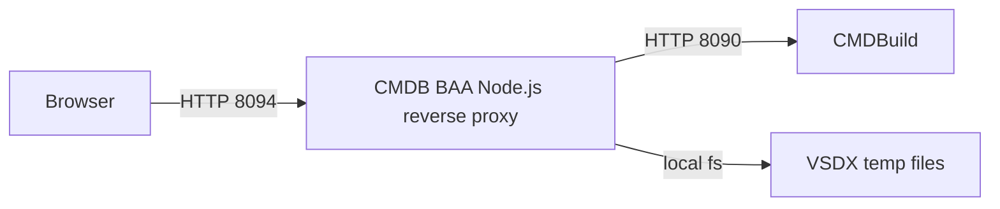

# Схема развертывания

## Контур разработки

Схема разработки приведена для сопровождения текущего репозитория.

## Контур эксплуатации

Для тестового/продуктивного контуров требуется отдельная VSDX-схема с
фактическими узлами, балансировщиками и сетевой связанностью.

Минимальные требования:

- браузер пользователя должен иметь доступ к reverse proxy по HTTPS;
- reverse proxy должен иметь доступ к CMDBuild REST API;
- порты и протоколы должны быть указаны на каждой сетевой связи;
- секрет CSRF и параметры cookie задаются через переменные окружения;
- временные VSDX файлы не должны сохраняться дольше обработки запроса.
