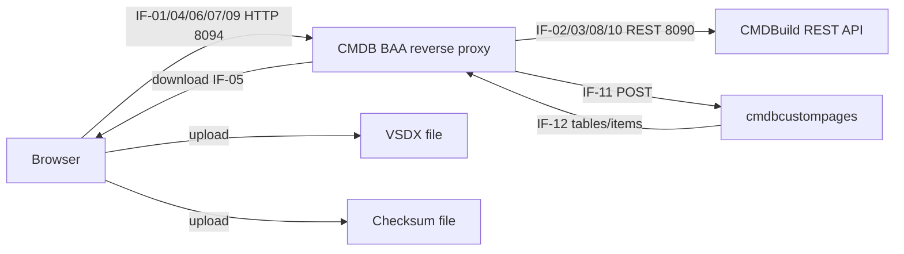

# Информационная модель

## Участники

- `Browser` - браузер пользователя с CMDBuild custom page.
- `CMDB BAA reverse proxy` - Node.js proxy и BFF.
- `CMDBuild REST API` - backend CMDBuild.
- `cmdbcustompages` - внешний custom page/endpoint бизнес-верификации.
- `VSDX file` - загружаемый/скачиваемый файл Visio.
- `Checksum file` - sidecar checksum.

## Информационные потоки

| ID | Направление данных | Канал | Данные | Порт |
|---|---|---|---|---|
| IF-01 | Browser -> CMDB BAA reverse proxy | HTTP POST `/cmdbuild/baa/api/vsdx/inspect` | VSDX base64, checksum text, настройки | 8094 |
| IF-02 | CMDB BAA reverse proxy -> CMDBuild REST API | REST `/cmdbuild/services/rest/v3/sessions/current` | CMDBuild session token из cookie | 8090 |
| IF-03 | CMDB BAA reverse proxy -> CMDBuild REST API | REST classes/cards/attributes | классы, атрибуты, контракты, версии | 8090 |
| IF-04 | Browser -> CMDB BAA reverse proxy | HTTP POST `/cmdbuild/baa/api/vsdx/enrich` | маппинг, параметры контракта, VSDX | 8094 |
| IF-05 | CMDB BAA reverse proxy -> Browser | HTTP response | enriched VSDX, checksum | 8094 |
| IF-06 | Browser -> CMDB BAA reverse proxy | HTTP POST `/cmdbuild/baa/api/vsdx/check-template` | VSDX base64 | 8094 |
| IF-07 | Browser -> CMDB BAA reverse proxy | HTTP POST `/cmdbuild/baa/api/vsdx/create-objects` | VSDX base64, overrides, class rules | 8094 |
| IF-08 | CMDB BAA reverse proxy -> CMDBuild REST API | REST cards create | payload создаваемых CMDB объектов | 8090 |
| IF-09 | Browser -> CMDB BAA reverse proxy | HTTP POST `/cmdbuild/baa/api/verification/contracts/publish` | input/output contract drafts | 8094 |
| IF-10 | CMDB BAA reverse proxy -> CMDBuild REST API | REST cards create | BAAVerificationInputContract, BAAVerificationOutputContract, BAAVerificationEndpoint, ResultInterpretationJson | 8090 |
| IF-11 | CMDB BAA reverse proxy -> cmdbcustompages | HTTP POST endpoint URL | подготовленный план и параметры вызова | 8090/8094 |
| IF-12 | cmdbcustompages -> CMDB BAA reverse proxy | HTTP response JSON | success/status, items, tables, табличные строки для интерпретации BAA | 8090/8094 |

Направление стрелки соответствует направлению передачи данных.

## Логическая схема

## OpenAPI

Синхронные HTTP API описаны в [OpenAPI-контуре](openapi.md). Формальная OAS
спецификация может быть добавлена отдельным файлом, когда API стабилизируется.
